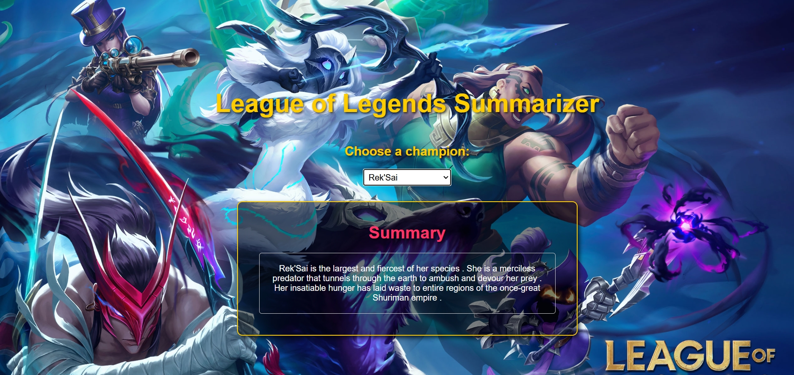

# League of Legends Summarizer

This project is a **League of Legends Champion Story Summarizer**. Users can select a champion from the dropdown menu, and the app will display a summarized version of their lore using a custom summarization model.

## Features

- Dropdown menu to select a champion.
- Integration with a backend API to fetch lore summaries.
- Beautiful UI with a themed background and responsive design.
- Highlights key sections like title, dropdown menu, and summary for readability.

---

## Installation

Follow these steps to set up the project locally:

### Prerequisites

- **Node.js** (for the frontend)
- **Python 3.11+** (for the backend)
- **npm**
- **Git**

### Backend Setup

1. Navigate to the `backend` directory:
   ```bash
   cd backend

2. Create and activate a virtual environment:
   ```bash
   python -m venv .venv
   source .venv/bin/activate
   
3. Install dependencies:
   ```bash
   pip install -r requirements.txt

4. Start the Flask server:
   ```bash
   python app.py

---

### Frontend Setup

1. Open second terminal and navigate to the `frontend` directory:
   ```bash
   cd frontend

2. Install dependencies:
   ```bash
   npm install

3. Start the React development server:
   ```bash
   npm start

---

## Usage

1. Select a champion from the dropdown menu.
2. View the summarized lore in the summary section.
3. The backend fetches the summaries using a Hugging Face model.

---

## Screenshots



---

## Future Improvements

- Add search functionality for champions.

---

## License

This project contains intellectual property that is not owned by the repository owner:
- **Background image**: Copyright of Riot Games.
- **Champion stories and lore**: Copyright of Riot Games.

These assets are used for educational and demonstrative purposes only and remain the sole property of their respective owners.


---

## Contact

For questions, support, or feedback, please refer to the contact information in my GitHub profile description.
